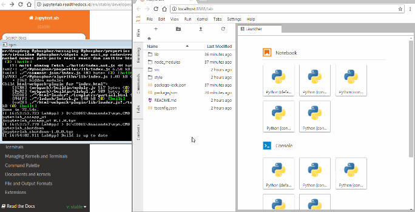

# jupyterlab_shutdown

A `Quit` entry in File menu.

This extension is based on https://github.com/jupyter/notebook/pull/3004 .
Warning: It does not use the option `NotebookApp.shutdown_button` introduce 
for the classical notebook as JupyterLab separates more the frontend and the backend.
See https://github.com/jupyterlab/jupyterlab/issues/2790 .



## Prerequisites

* JupyterLab 0.33

## Installation

```bash
jupyter labextension install jupyterlab_shutdown
```

## Development

For a development install (requires npm version 4 or later), do the following in the repository directory:

```bash
npm install
npm run build
jupyter labextension install .
```

To rebuild the package and the JupyterLab app:

```bash
npm run build
jupyter lab build
```

